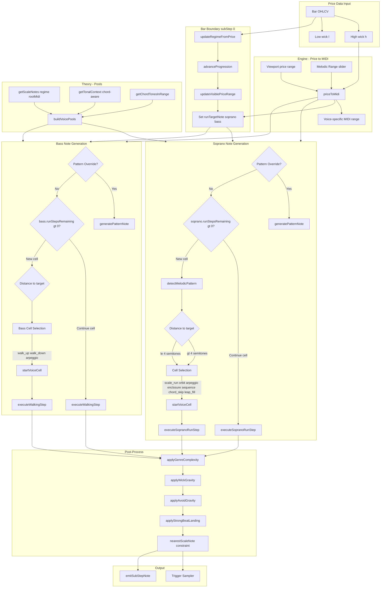
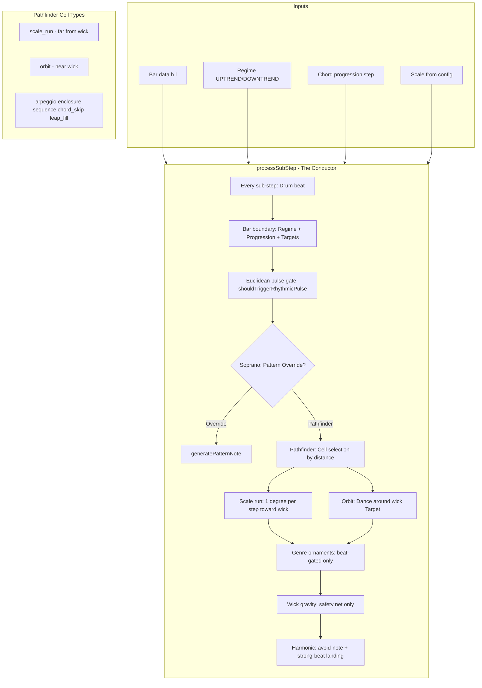

# Melody Generation — Data Flow

This diagram describes how the Pathfinding Sequencer generates soprano and bass notes from price data.

## Data Flow (Mermaid)

## Simplified Flow (Conductor-centric)

## Key Concepts

| Concept | Location | Description |
|---------|----------|-------------|
| **priceToMidi** | engine.js | Maps OHLC high/low to soprano/bass MIDI using viewport range + Melodic Range |
| **Regime** | theory.js | UPTREND/DOWNTREND from price trend; selects scale (e.g. Major vs Minor) |
| **Cell** | pathfinder.js | 4–8 note melodic unit: scale_run, orbit, arpeggio, enclosure, etc. |
| **Distance-based selection** | conductor.js | \>4 semitones → scale_run; ≤4 → orbit; Complexity adds stochastic interruptions |
| **Wick gravity** | pathfinder.js | Safety net only for extreme drift; cells handle normal tracking |
| **Pattern Override** | conductor.js | Bypasses pathfinder; uses deterministic patterns (scale_asc, root_only, etc.) |
